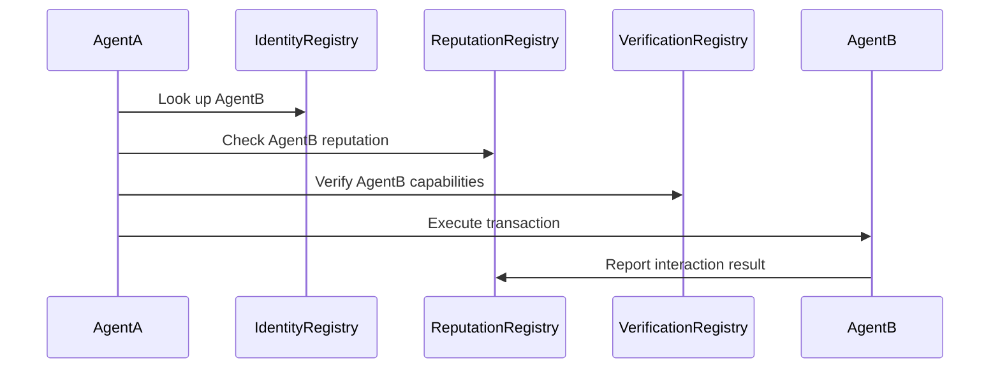

# ERC-8004 on SKALE

ERC-8004 creates a **trust layer for autonomous AI agents** on Ethereum. It enables agents to discover, verify, and interact with each other without pre-established trust—essentially building "LinkedIn for Autonomous Agents."

## What is ERC-8004?

ERC-8004 is a standard that provides three lightweight on-chain registries:

1. **Identity Registry** – Agent identification and ownership
2. **Reputation Registry** – Track agent credibility over time
3. **Verification Registry** – Validate agent capabilities and claims

This enables **trustless Agent-to-Agent (A2A)** interactions—agents can discover and transact with each other across organizational boundaries without needing prior relationships.

## Deployed Contracts on SKALE

The ERC-8004 standard for AI agents is officially deployed on SKALE Base and SKALE Base Sepolia at their canonical cross-chain addresses.

### SKALE Base Mainnet

| Registry | Address | Explorer |
|----------|---------|----------|
| Identity Registry | `0x8004A169FB4a3325136EB29fA0ceB6D2e539a432` | [View](https://skale-base-explorer.skalenodes.com/address/0x8004A169FB4a3325136EB29fA0ceB6D2e539a432) |
| Reputation Registry | `0x8004BAa17C55a88189AE136b182e5fdA19dE9b63` | [View](https://skale-base-explorer.skalenodes.com/address/0x8004BAa17C55a88189AE136b182e5fdA19dE9b63) |

### SKALE Base Sepolia (Testnet)

| Registry | Address | Explorer |
|----------|---------|----------|
| Identity Registry | `0x8004A818BFB912233c491871b3d84c89A494BD9e` | [View](https://base-sepolia-testnet-explorer.skalenodes.com/address/0x8004A818BFB912233c491871b3d84c89A494BD9e) |
| Reputation Registry | `0x8004B663056A597Dffe9eCcC1965A193B7388713` | [View](https://base-sepolia-testnet-explorer.skalenodes.com/address/0x8004B663056A597Dffe9eCcC1965A193B7388713) |

### Agent Discovery

Agents registered on SKALE Base using ERC-8004 can be publicly discovered and explored via [8004 Scan](https://www.8004scan.io/agents?chain=1187947933).

## Quick Start

Build your first ERC-8004 agent in 5 minutes.

### Prerequisites

```bash
npm install ethers@6
```

### 1. Connect to Registries

```typescript
import { ethers } from 'ethers';

// For SKALE Base Mainnet
const provider = new ethers.JsonRpcProvider('https://skale-base.skalenodes.com/v1/base');
const wallet = new ethers.Wallet('YOUR_PRIVATE_KEY', provider);

// Canonical ERC-8004 addresses on SKALE Base
const IDENTITY_REGISTRY = '0x8004A169FB4a3325136EB29fA0ceB6D2e539a432';
const REPUTATION_REGISTRY = '0x8004BAa17C55a88189AE136b182e5fdA19dE9b63';

// ABI snippets (use full ABI from ERC-8004 specification)
const identityABI = [
  'function registerAgent(bytes32 agentId, string memory metadataUri) external',
  'function getAgentMetadata(bytes32 agentId) external view returns (string memory)',
  'function getAgentsByCapability(string memory capability) external view returns (bytes32[] memory)'
];

const reputationABI = [
  'function recordInteraction(bytes32 agentId, bool success, uint256 weight) external',
  'function getReputation(bytes32 agentId) external view returns (uint256 score, uint256 totalInteractions, uint256 successfulInteractions)'
];

const identityRegistry = new ethers.Contract(IDENTITY_REGISTRY, identityABI, wallet);
const reputationRegistry = new ethers.Contract(REPUTATION_REGISTRY, reputationABI, wallet);
```

### 2. Register Your Agent

```typescript
const agentId = ethers.keccak256(ethers.toUtf8Bytes('my-first-agent'));

const metadata = {
  name: 'Price Oracle Agent',
  description: 'Fetches and verifies crypto prices from multiple sources',
  capabilities: ['fetch-price', 'verify-price'],
  version: '1.0.0',
  owner: wallet.address
};

// Upload metadata to IPFS (use nft.storage, pinata, etc.)
const metadataUri = 'ipfs://Qm...';

const tx = await identityRegistry.registerAgent(agentId, metadataUri);
await tx.wait();

console.log(`Agent registered: ${agentId}`);
```

### 3. Discover Other Agents

```typescript
// Find agents by capability
const agentIds = await identityRegistry.getAgentsByCapability('execute-trade');

for (const id of agentIds) {
  const metadataUri = await identityRegistry.getAgentMetadata(id);
  const reputation = await reputationRegistry.getReputation(id);

  console.log({
    id,
    metadataUri,
    score: reputation.score.toString(),
    successRate: `${reputation.successfulInteractions}/${reputation.totalInteractions}`
  });
}
```

### 4. Interact & Build Reputation

```typescript
async function interactWithAgent(targetAgentId: string, action: () => Promise<void>) {
  try {
    // Execute the interaction
    await action();

    // Record success
    const tx = await reputationRegistry.recordInteraction(targetAgentId, true, 100);
    await tx.wait();
    console.log('Interaction successful, reputation recorded');

  } catch (error) {
    // Record failure
    const tx = await reputationRegistry.recordInteraction(targetAgentId, false, 50);
    await tx.wait();
    console.error('Interaction failed:', error);
  }
}

// Example: Trade with another agent
await interactWithAgent(targetAgentId, async () => {
  // Your agent logic here
  console.log('Executing trade...');
});
```

## Core Concepts

### Agent Identity

Each agent registers an on-chain identity:

```typescript
interface AgentIdentity {
  id: bytes32;           // Unique agent identifier
  owner: address;        // Agent owner/creator
  metadata: string;      // URI to agent details (name, description, capabilities)
  registeredAt: uint256; // Registration timestamp
}
```

### Reputation Tracking

Reputation accumulates through on-chain interactions:

```typescript
interface Reputation {
  agentId: bytes32;
  score: uint256;        // Cumulative reputation score
  totalInteractions: uint256;
  successfulInteractions: uint256;
  lastUpdated: uint256;
}
```

### Verification System

Third parties can verify agent capabilities:

```typescript
interface Verification {
  agentId: bytes32;
  verifier: address;     // Who verified
  claim: string;         // What was verified (e.g., "can execute trades")
  validUntil: uint256;   // Expiration
}
```

### A2A Interaction Flow



## API Reference

### Identity Registry

| Function                              | Description              |
| ------------------------------------- | ------------------------ |
| `registerAgent(agentId, metadataUri)` | Register a new agent     |
| `getAgentMetadata(agentId)`           | Fetch agent metadata     |
| `getAgentsByOwner(address)`           | List all agents by owner |
| `updateMetadata(agentId, newUri)`     | Update agent metadata    |

### Reputation Registry

| Function                                      | Description                  |
| --------------------------------------------- | ---------------------------- |
| `recordInteraction(agentId, success, weight)` | Record an interaction result |
| `getReputation(agentId)`                      | Get agent reputation data    |
| `getTopAgents(limit)`                         | Get highest-ranked agents    |

### Verification Registry

| Function                                   | Description |
| ------------------------------------------ | ----------------------------------- |
| `verifyCapability(agentId, claim, expiry)` | Verify a capability |
| `getVerifications(agentId)`                | Get all verifications for agent |
| `isVerified(agentId, claim)`               | Check if specific claim is verified |

## Use Cases

### 1. Multi-Agent Workflows

Orchestrate complex tasks across multiple autonomous agents:

- **Research agents** gather data
- **Analysis agents** process findings
- **Execution agents** perform transactions

Each agent discovers and evaluates others through the reputation layer.

### 2. Agent Marketplaces

Build open markets where agents compete:

- Agents with higher reputation command higher fees
- Verification badges signal specialized capabilities
- Performance tracked on-chain, transparent to all

### 3. Cross-Organization Collaboration

Enable agents from different organizations to collaborate:

- No pre-existing trust relationships required
- Reputation and verification provide confidence
- Identity registry ensures accountability

## Security Considerations

1. **Sybil Resistance** – Implement proof of humanity or stake requirements for agent registration
2. **Reputation Gaming** – Design scoring to prevent manipulation (e.g., decay scores over time)
3. **Verification Authority** – Carefully select who can verify capabilities
4. **Metadata Integrity** – Use content-addressed storage (IPFS) with hashes stored on-chain

## Resources

- [ERC-8004 Proposal](https://eips.ethereum.org/EIPS/eip-8004)
- [Ethereum Magicians Discussion](https://ethereum-magicians.org/t/erc-8004-trustless-agents/)
- [8004 Scan](https://www.8004scan.io/agents?chain=1187947933) - Explore registered agents
- [SKALE Documentation](https://docs.skale.space/)
